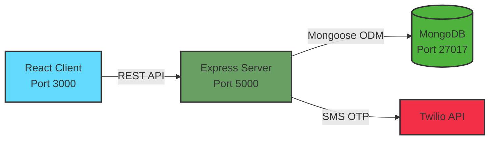
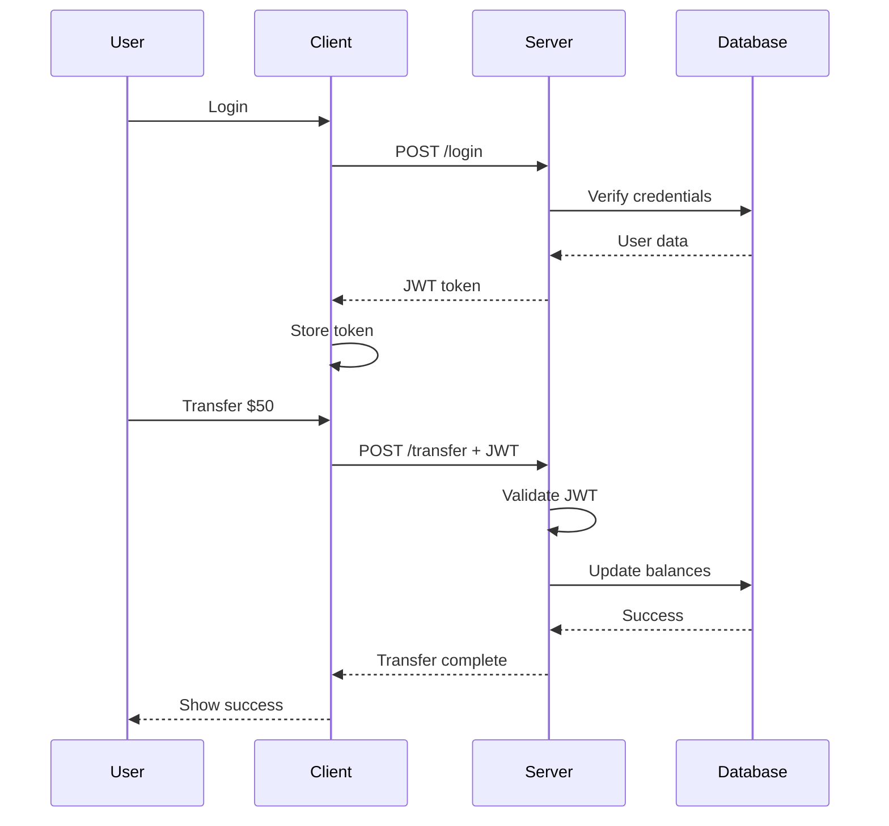

# 🏦 Secure Banking Application

[](https://opensource.org/licenses/MIT)
[](https://nodejs.org/)
[](https://reactjs.org/)
[](https://www.mongodb.com/)
[](https://www.docker.com/)
[](https://github.com/amit9021/Secure-Banking/actions)

> A full-stack MERN (MongoDB, Express.js, React, Node.js) banking application with JWT authentication, real-time balance tracking, and secure money transfers.

[Features](#-features) • [Quick Start](#-quick-start) • [Documentation](#-documentation) • [API](#-api-reference) • [Contributing](#-contributing)

---

## 📋 Table of Contents

- [Overview](#-overview)
- [Features](#-features)
- [Quick Start](#-quick-start)
- [Architecture](#-architecture)
- [Tech Stack](#-tech-stack)
- [Prerequisites](#-prerequisites)
- [Project Structure](#-project-structure)
- [Configuration](#-configuration)
- [Development](#-development)
- [Testing](#-testing)
- [Deployment](#-deployment)
- [API Reference](#-api-reference)
- [Security](#-security)
- [Contributing](#-contributing)
- [License](#-license)
- [Contact](#-contact)

---

## 🎯 Overview

**Secure Banking** is a modern, full-stack web application that simulates core banking operations. Built with the MERN stack, it demonstrates best practices in full-stack development, authentication, and financial data management.

### Key Highlights

- **🔐 Secure Authentication**: JWT-based auth with OTP verification via Twilio SMS
- **💰 Real-Time Banking**: Instant balance updates and transaction history
- **🚀 Fully Containerized**: Docker Compose for one-command deployment
- **📱 Responsive UI**: Material-UI design that works on all devices
- **🧪 Well-Tested**: Unit and integration tests with Jest
- **📦 CI/CD Ready**: GitHub Actions for automated testing and deployment
- **☁️ Cloud-Native**: Deployed on AWS EC2 with ECR for container registry

---

## 🚀 Quick Start

### Option 1: Docker Compose (Recommended)

The fastest way to get started:

```bash
# 1. Clone the repository
git clone https://github.com/amit9021/Secure-Banking.git
cd Secure-Banking

# 2. Create environment files
cp server/.env.example server/.env
cp client/.env.example client/.env

# 3. Edit server/.env with your credentials
# At minimum, set:
#   - JWT_TOKEN (generate with: openssl rand -hex 32)
#   - TWILIO_ACCOUNT_ID, TWILIO_TOKEN, TWILIO_SERVICE (optional for OTP)

# 4. Start all services (client + server + MongoDB)
docker-compose -f infra/docker-compose.yml up

# 5. Seed the database (in another terminal)
docker-compose -f infra/docker-compose.yml exec server npm run seed

# 6. Open your browser
# Client: http://localhost:3000
# Server: http://localhost:5000
# API Docs: http://localhost:5000/api-docs
```

### Option 2: Manual Setup

If you prefer to run services individually:

```bash
# 1. Clone and navigate to project
git clone https://github.com/amit9021/Secure-Banking.git
cd Secure-Banking

# 2. Install server dependencies
cd server
npm install
cp .env.example .env
# Edit .env with your values

# 3. Install client dependencies
cd ../client
npm install
cp .env.example .env

# 4. Start MongoDB (if not using Docker)
# macOS:
brew services start mongodb-community

# Linux:
sudo systemctl start mongod

# Windows:
net start MongoDB

# 5. Seed the database
cd ../server
npm run seed

# 6. Start the server (Terminal 1)
npm run dev

# 7. Start the client (Terminal 2)
cd ../client
npm start

# 8. Open http://localhost:3000
```

### 🎉 First Login

After seeding the database, use these demo credentials:

```
Email: demo@bank.com
Password: password123
Initial Balance: $1,000.00
```

**Other demo users:**

- alice@example.com / password123 ($5,000)
- bob@example.com / password123 ($2,500)
- charlie@example.com / password123 ($750)

---

## ⚙️ Configuration

### Environment Variables

#### Server (`server/.env`)

```bash
# Server Configuration
NODE_ENV=development
PORT=5000

# Database
MONGODB_URI=mongodb://mongodb:27017/bank_users

# JWT Authentication (REQUIRED)
# Generate with: openssl rand -hex 32
JWT_TOKEN=your_secure_jwt_secret_here

# Twilio SMS/OTP Service (optional, for registration OTP)
TWILIO_ACCOUNT_ID=your_twilio_account_sid
TWILIO_TOKEN=your_twilio_auth_token
TWILIO_SERVICE=your_twilio_messaging_service_sid
```

#### Client (`client/.env`)

```bash
# API Configuration
REACT_APP_API_URL=http://localhost:5000

# App Configuration
REACT_APP_NAME=Secure Banking
REACT_APP_VERSION=1.0.0
```

---

## ✨ Features

### User Authentication

- ✅ User registration with SMS OTP verification (Twilio)
- ✅ Secure login with JWT token (30-minute expiration)
- ✅ Protected routes and session management
- ✅ Account deletion

### Banking Operations

- 💵 View current account balance
- 📊 Transaction history tracking (credits and debits)
- 💸 Transfer money to other users by email
- 🎁 Initial $100 balance on registration
- 🔄 Reset balance (admin feature)

### User Interface

- 📱 Responsive Material-UI design
- 🎨 Modern, intuitive dashboard
- ⚡ Real-time balance updates
- 🔔 Transaction success/error notifications
- 🎯 Easy-to-use transfer modal

### Developer Experience

- 🐳 Docker & Docker Compose support
- 🔧 Hot reload for both client and server
- 📝 Comprehensive API documentation (Swagger)
- 🧪 Automated tests with coverage reports
- 🚦 CI/CD with GitHub Actions
- 📋 ESLint & Prettier for code quality

---

## 🏗️ Architecture

### High-Level Overview



### Request Flow



### Three-Tier Architecture

| Layer            | Technology          | Responsibility                      |
| ---------------- | ------------------- | ----------------------------------- |
| **Presentation** | React + Material-UI | User interface, forms, routing      |
| **Application**  | Express.js + JWT    | Business logic, authentication, API |
| **Data**         | MongoDB + Mongoose  | Data persistence, transactions      |

📚 **For detailed architecture**, see [docs/architecture.md](docs/architecture.md)

---

## 🛠️ Tech Stack

### Frontend

- **React** 18.3.1 - UI library
- **React Router** 6.28.0 - Client-side routing
- **Material-UI (MUI)** 6.1.7 - Component library
- **Axios** 1.7.7 - HTTP client
- **Emotion** 11.13.0 - CSS-in-JS styling

### Backend

- **Node.js** 18.x - Runtime environment
- **Express.js** 4.21.1 - Web framework
- **Mongoose** 8.8.1 - MongoDB ODM
- **JWT** 9.0.2 - Authentication
- **Twilio** 5.3.6 - SMS/OTP service
- **Swagger UI** 5.0.1 - API documentation

### Database

- **MongoDB** 7.x - NoSQL database

### DevOps & Tools

- **Docker** & **Docker Compose** - Containerization
- **Jest** 29.7.0 - Testing framework
- **Supertest** 7.0.0 - API testing
- **ESLint** - Code quality
- **Prettier** - Code formatting
- **GitHub Actions** - CI/CD
- **AWS ECR** - Container registry
- **AWS EC2** - Deployment (previously)

---

## 📦 Prerequisites

Before you begin, ensure you have the following installed:

- **Node.js** 18.x or higher ([Download](https://nodejs.org/))
- **npm** 9.x or higher (comes with Node.js)
- **Docker** & **Docker Compose** ([Download](https://www.docker.com/))
- **Git** ([Download](https://git-scm.com/))
- **MongoDB** (optional if using Docker)

### Optional

- **Twilio Account** - For OTP SMS functionality ([Sign up](https://www.twilio.com/))
- **AWS Account** - For production deployment

---

### Security Notes

⚠️ **IMPORTANT:**

- **Never commit `.env` files** to version control
- **Generate a strong JWT secret**: `openssl rand -hex 32`
- **Use different secrets** for dev/staging/production
- **Rotate secrets regularly** (quarterly recommended)

---

## 💻 Development

### Running in Development Mode

```bash
# Server (with hot reload)
cd server
npm run dev

# Client (with hot reload)
cd client
npm run dev
```

### Code Quality

```bash
# Lint code
npm run lint

# Fix lint issues
npm run lint:fix

# Check code formatting
npm run format:check

# Format code
npm run format
```

### Database Management

```bash
# Seed database with demo data
cd server
npm run seed

# Reset database (clears all data)
npm run reset
```

### Available Scripts

#### Server

```json
{
  "start": "node index.js", // Production mode
  "dev": "nodemon index.js", // Development mode with auto-reload
  "test": "jest", // Run tests
  "test:watch": "jest --watch", // Run tests in watch mode
  "test:coverage": "jest --coverage", // Generate coverage report
  "lint": "eslint .", // Lint code
  "lint:fix": "eslint . --fix", // Fix lint issues
  "format": "prettier --write .", // Format code
  "seed": "node ../scripts/seed.js", // Seed database
  "reset": "node ../scripts/reset.js" // Reset database
}
```

#### Client

```json
{
  "start": "react-scripts start", // Development mode
  "build": "react-scripts build", // Production build
  "test": "react-scripts test", // Run tests
  "lint": "eslint src/", // Lint code
  "format": "prettier --write src/" // Format code
}
```

---

## 🧪 Testing

### Run Tests

```bash
# Server tests
cd server
npm test

# Client tests
cd client
npm test

# With coverage
npm run test:coverage
```

### Test Structure

```
server/tests/
├── integration/
│   ├── login.test.js          # Login endpoint tests
│   ├── register.test.js       # Registration tests
│   └── dashboard.test.js      # Dashboard tests
├── unit/
│   └── utils.test.js          # Utility function tests
└── setup.js                   # Test environment setup
```

### Coverage Goals

- **Statements**: >80%
- **Branches**: >75%
- **Functions**: >80%
- **Lines**: >80%

### Continuous Integration

Tests run automatically on:

- Every push to `main`/`master`/`develop`
- Every pull request
- Via GitHub Actions (see [`.github/workflows/ci.yml`](.github/workflows/ci.yml))

---

## 🚢 Deployment

### Docker Production Build

```bash
# Build production images
docker-compose -f infra/docker-compose.prod.yml build

# Run in production mode
docker-compose -f infra/docker-compose.prod.yml up -d

# View logs
docker-compose -f infra/docker-compose.prod.yml logs -f

# Stop services
docker-compose -f infra/docker-compose.prod.yml down
```

### AWS Deployment (EC2 + ECR)

```bash
# 1. Authenticate to ECR
aws ecr get-login-password --region eu-west-2 | \
  docker login --username AWS --password-stdin <account-id>.dkr.ecr.eu-west-2.amazonaws.com

# 2. Build and tag images
docker build -t secure-banking-server ./server
docker tag secure-banking-server:latest \
  <account-id>.dkr.ecr.eu-west-2.amazonaws.com/secure-banking-server:latest

# 3. Push to ECR
docker push <account-id>.dkr.ecr.eu-west-2.amazonaws.com/secure-banking-server:latest

# 4. Deploy on EC2
ssh -i your-key.pem ec2-user@your-ec2-ip
docker pull <ecr-url>/secure-banking-server:latest
docker run -d -p 5000:5000 \
  -e MONGODB_URI=your_db_uri \
  -e JWT_TOKEN=your_secret \
  <ecr-url>/secure-banking-server:latest
```

### Environment-Specific Configuration

Create separate `.env` files for each environment:

- `.env.development` - Local development
- `.env.staging` - Staging server
- `.env.production` - Production server

📖 **Full deployment guide**: [infra/README.md](infra/README.md)

---

## 📚 API Reference

### Base URL

```
http://localhost:5000
```

### Authentication

Include JWT token in the Authorization header:

```
Authorization: Bearer <your_token>
```

### Endpoints Overview

| Method | Endpoint                  | Auth | Description                       |
| ------ | ------------------------- | ---- | --------------------------------- |
| POST   | `/login`                  | No   | User login                        |
| POST   | `/register`               | No   | Initiate registration (sends OTP) |
| POST   | `/register/otp_validator` | No   | Validate OTP and create account   |
| GET    | `/dashboard`              | Yes  | Get balance and transactions      |
| POST   | `/transfer`               | Yes  | Transfer money to another user    |
| GET    | `/register`               | Yes  | Get user name                     |
| DELETE | `/register`               | Yes  | Delete user account               |
| PUT    | `/register/reset_balance` | Yes  | Reset account balance             |
| GET    | `/`                       | Yes  | Check authentication status       |

### Example: Transfer Money

```bash
curl -X POST http://localhost:5000/transfer \
  -H "Authorization: Bearer YOUR_JWT_TOKEN" \
  -H "Content-Type: application/json" \
  -d '{
    "to_account": "alice@example.com",
    "amount": 50.00
  }'
```

**Response:**

```json
{
  "message": "Transfer successful",
  "data": {
    "from": "demo@bank.com",
    "to": "alice@example.com",
    "amount": 50.0,
    "newBalance": 950.0
  }
}
```

### Interactive API Documentation

Explore the full API using Swagger UI:

```
http://localhost:5000/api-docs
```

📖 **Complete API documentation**: [docs/api.md](docs/api.md)

---

## 🔐 Security

### Current Security Measures

✅ **Implemented:**

- JWT authentication with 30-minute expiration
- OTP verification via SMS (Twilio)
- CORS enabled
- Environment-based configuration
- Protected routes middleware
- MongoDB connection security

### ⚠️ Known Security Issues

**CRITICAL - Fix Before Production:**

| Issue                         | Risk   | Fix                         |
| ----------------------------- | ------ | --------------------------- |
| Passwords stored in plaintext | High   | Implement bcrypt hashing    |
| No rate limiting              | High   | Add express-rate-limit      |
| OTP never expires             | Medium | Add TTL index (10 min)      |
| CORS allows all origins       | Medium | Whitelist production domain |
| JWT in localStorage           | Medium | Use httpOnly cookies        |

📖 **Full security guide**: [docs/security.md](docs/security.md)

---

## 🙏 Acknowledgments

- [MongoDB](https://www.mongodb.com/) - Database
- [Express.js](https://expressjs.com/) - Web framework
- [React](https://reactjs.org/) - UI library
- [Node.js](https://nodejs.org/) - Runtime
- [Material-UI](https://mui.com/) - Component library
- [Twilio](https://www.twilio.com/) - SMS/OTP service
- [Docker](https://www.docker.com/) - Containerization
- [AWS](https://aws.amazon.com/) - Cloud infrastructure

---
