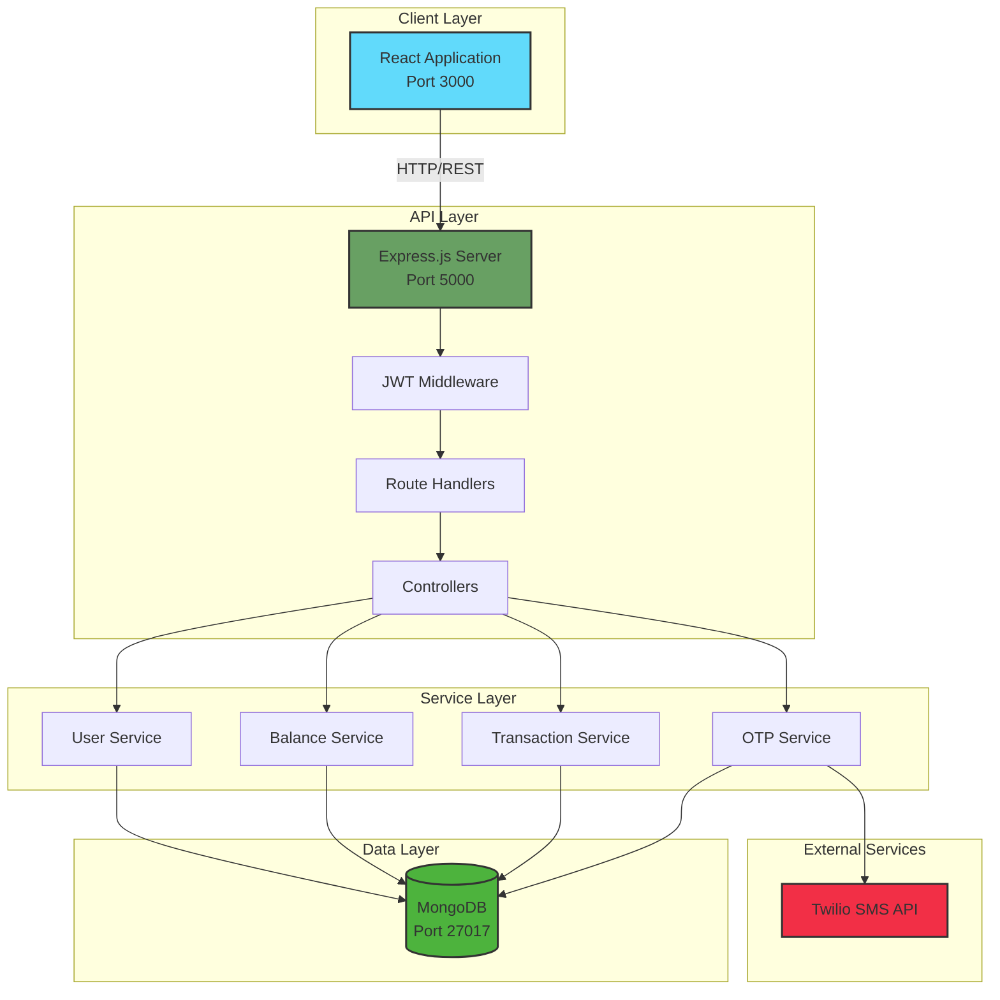
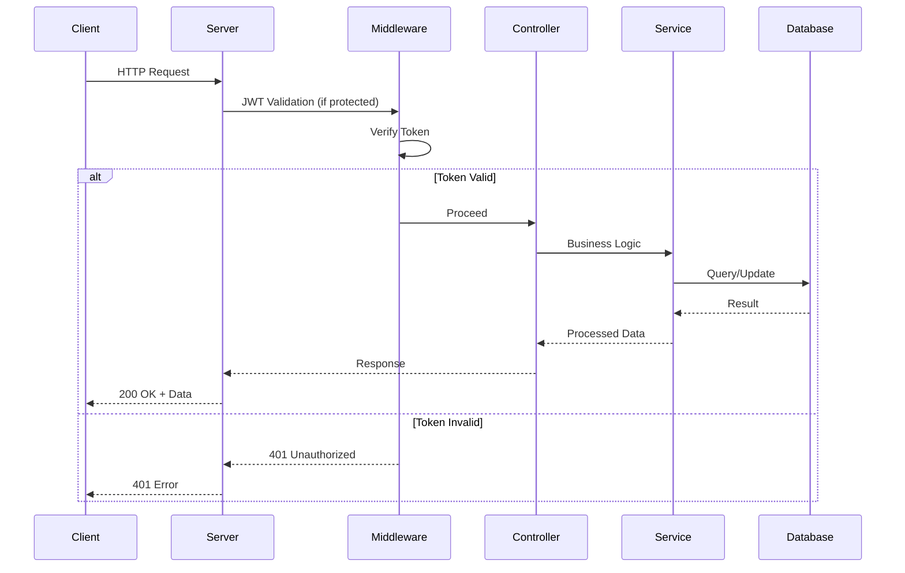
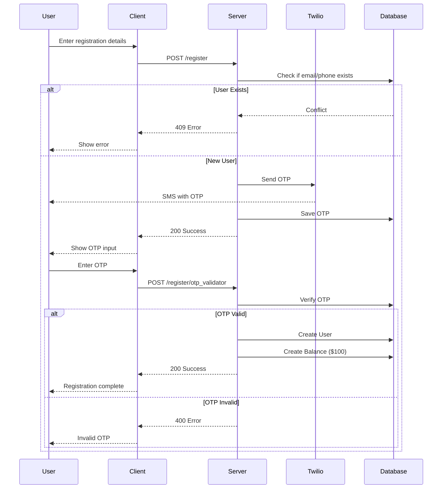
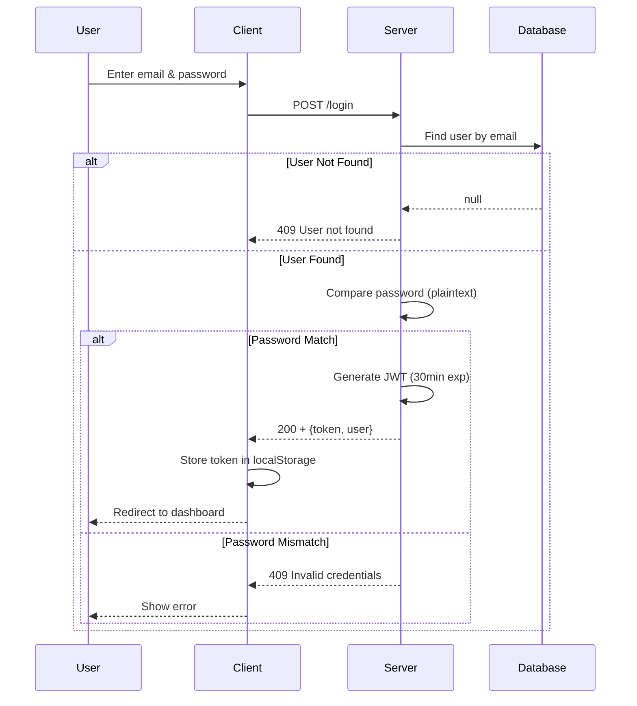
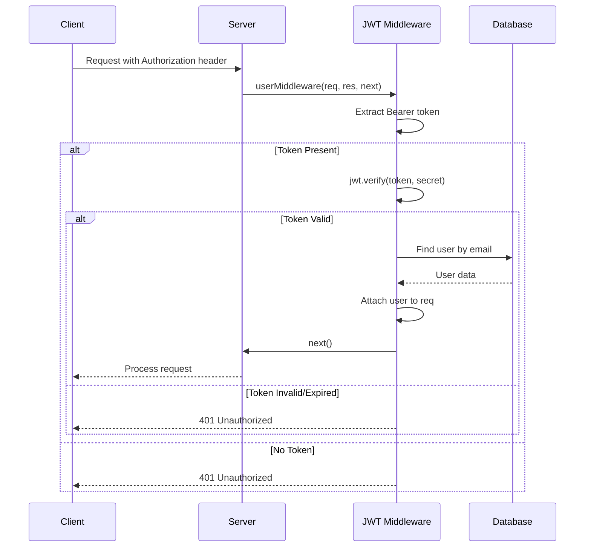
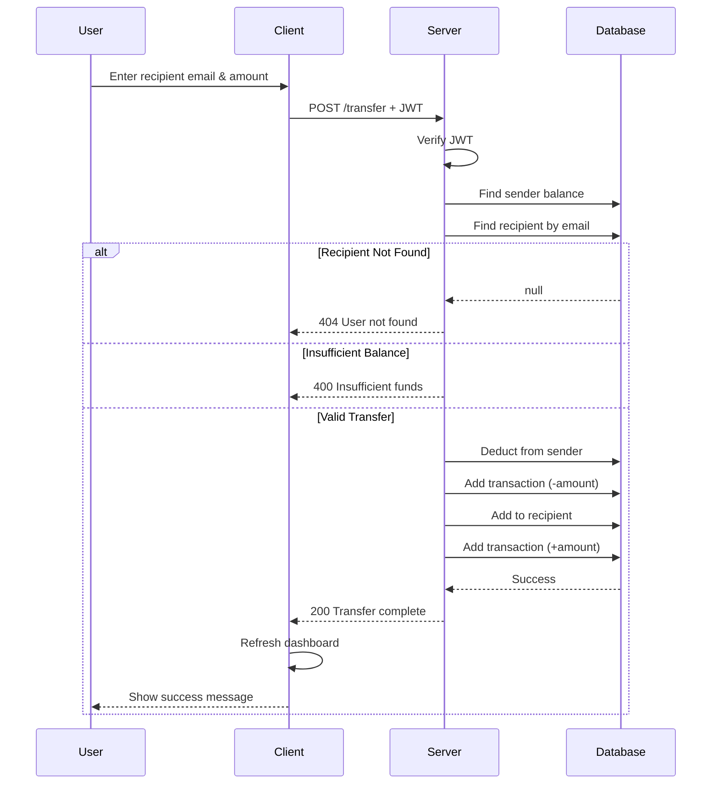

# System Architecture

This document provides a comprehensive overview of the Secure Banking application architecture, including system design, data flow, and technical implementation details.

## Table of Contents

- [High-Level Architecture](#high-level-architecture)
- [Technology Stack](#technology-stack)
- [System Components](#system-components)
- [Data Flow](#data-flow)
- [Authentication Flow](#authentication-flow)
- [Transfer Money Flow](#transfer-money-flow)
- [Database Schema](#database-schema)
- [Design Patterns](#design-patterns)
- [Security Architecture](#security-architecture)

## High-Level Architecture



## Technology Stack

### Frontend

| Technology | Version | Purpose |
|------------|---------|---------|
| React | 18.3.1 | UI framework |
| React Router | 6.28.0 | Client-side routing |
| Material-UI (MUI) | 6.1.7 | Component library |
| Axios | 1.7.7 | HTTP client |
| Emotion | 11.13.0 | CSS-in-JS styling |

### Backend

| Technology | Version | Purpose |
|------------|---------|---------|
| Node.js | 18.x | Runtime environment |
| Express.js | 4.21.1 | Web framework |
| Mongoose | 8.8.1 | MongoDB ODM |
| JWT | 9.0.2 | Authentication |
| Twilio | 5.3.6 | SMS/OTP service |
| Swagger UI | 5.0.1 | API documentation |

### Database

| Technology | Version | Purpose |
|------------|---------|---------|
| MongoDB | 7.x | NoSQL database |

### DevOps

| Technology | Purpose |
|------------|---------|
| Docker | Containerization |
| Docker Compose | Multi-container orchestration |
| GitHub Actions | CI/CD pipeline |
| AWS ECR | Container registry |
| AWS EC2 | Deployment platform |

## System Components

### 1. Client Application (React)

**Location:** `/client`

**Responsibilities:**
- User interface rendering
- Client-side routing
- Form validation
- State management
- API communication
- JWT token storage

**Key Components:**
```
client/src/
├── pages/
│   ├── Home.js          # Landing page
│   ├── Login.js         # Login form
│   ├── Register.js      # Registration & OTP
│   └── Dashboard.js     # User dashboard
├── components/
│   └── Transfer.js      # Transfer modal
└── services/
    └── api.js           # API client
```

### 2. API Server (Express)

**Location:** `/server`

**Responsibilities:**
- Request routing
- JWT authentication
- Business logic orchestration
- Data validation
- Error handling
- API documentation

**Architecture:**
```
server/
├── index.js                    # Entry point, middleware setup
├── routes/                     # Route definitions
│   ├── public/                 # Unauthenticated routes
│   │   ├── login.js           # POST /login
│   │   └── register.js        # POST /register, /register/otp_validator
│   └── authenticated/          # JWT-protected routes
│       ├── dashboard.js       # GET /dashboard
│       └── transfer.js        # POST /transfer
├── controllers/                # Request handlers
│   ├── public/
│   │   ├── login_controller.js
│   │   └── register_controller.js
│   └── authenticated/
│       ├── dashboard_controller.js
│       └── transfer_controller.js
├── models/                     # Mongoose schemas
│   ├── user_models.js
│   ├── balance_model.js
│   └── otp_models.js
└── utils/                      # Helper functions
    ├── user_utils.js          # JWT middleware, user queries
    └── utils.js               # OTP generation, SMS
```

### 3. Database (MongoDB)

**Location:** MongoDB container or cloud instance

**Collections:**
- `users` - User accounts
- `balances` - Account balances and transactions
- `otps` - Temporary OTP verification codes

### 4. External Services

**Twilio SMS API:**
- OTP delivery via SMS
- Phone number verification

## Data Flow

### Request Processing Flow



## Authentication Flow

### User Registration



### User Login



### Protected Route Access



## Transfer Money Flow



## Database Schema

### Users Collection

```javascript
{
  _id: ObjectId,
  name: String,          // Required, user's full name
  email: String,         // Required, unique, login identifier
  phone: String,         // Required, unique, for OTP
  password: String       // Required, plaintext (⚠️ NOT HASHED)
}
```

**Indexes:**
- `email` (unique)
- `phone` (unique)

### Balances Collection

```javascript
{
  _id: ObjectId,
  UserId: ObjectId,      // Required, ref: 'users'
  Balance: Number,       // Required, current balance
  Transactions: [Number] // Array of transaction amounts
                         // Positive = credit, Negative = debit
}
```

**Indexes:**
- `UserId` (unique)

**Example:**
```javascript
{
  UserId: "507f1f77bcf86cd799439011",
  Balance: 850.00,
  Transactions: [100, -50, 200, -75, -325]
  // Initial: 100, Spent 50, Received 200, Spent 75, Sent 325
}
```

### OTPs Collection

```javascript
{
  _id: ObjectId,
  phone: String,         // Required, recipient phone
  otp: String           // Required, unique, 6-digit code
}
```

**Indexes:**
- `otp` (unique)

**Lifecycle:** Temporary, deleted after validation or expiry

## Design Patterns

### 1. Layered Architecture

The application follows a **3-tier architecture**:

```
Presentation Layer (Client)
        ↓
Application Layer (API Server)
        ↓
Data Access Layer (Database)
```

**Benefits:**
- Separation of concerns
- Independent scalability
- Easier testing
- Clear boundaries

### 2. MVC Pattern (Server-Side)

```
Model (Mongoose Schemas)
    ↓
Controller (Request Handlers)
    ↓
View (JSON Responses)
```

**Example: Login Flow**
```javascript
// Route (routes/public/login.js)
router.post("/", LoginController.verifiedLogin);

// Controller (controllers/public/login_controller.js)
async verifiedLogin(req, res) {
  const user = await getUserByEmail(email); // Model
  // ... validation logic
  res.json({ token, user }); // View (JSON)
}

// Model (models/user_models.js)
const User = mongoose.model("users", UserSchema);
```

### 3. Repository Pattern

**User Utils (`utils/user_utils.js`)** acts as a data access layer:

```javascript
// Abstraction over database queries
getUserByEmail(email)
getUserByPhone(phone)
getBalanceByUserId(userId)
// ... etc
```

**Benefits:**
- Decouples business logic from data access
- Centralized query logic
- Easier to mock for testing

### 4. Middleware Pattern

**JWT Authentication Middleware:**

```javascript
// utils/user_utils.js
function userMiddleware(req, res, next) {
  const token = extractBearerToken(req);
  const decoded = jwt.verify(token, secret);
  const user = await getUserByEmail(decoded.email);
  req.user = user;
  next();
}
```

**Applied to routes:**
```javascript
router.get("/dashboard", userMiddleware, DashboardController);
```

### 5. Service-Oriented Pattern

Each domain has encapsulated logic:
- **Auth Service:** Registration, login, OTP
- **Balance Service:** Account queries, balance updates
- **Transaction Service:** Transfer orchestration

### 6. DTO Pattern (Data Transfer Objects)

Responses use structured DTOs:

```javascript
// Login response
{
  token: "eyJhbGc...",
  user: {
    email: "user@example.com",
    name: "John Doe"
  }
}

// Dashboard response
{
  balance: 1000.00,
  transactions: [100, -50, 200]
}
```

## Security Architecture

### 1. Authentication

**JWT (JSON Web Tokens):**
- Algorithm: HS256
- Expiration: 30 minutes
- Storage: Client localStorage
- Transmission: `Authorization: Bearer <token>`

**Flow:**
1. User logs in with email/password
2. Server validates credentials
3. Server generates JWT with email claim
4. Client stores token in localStorage
5. Client sends token with each request
6. Server validates token via middleware

### 2. Authorization

**Protected Routes:**
- All routes under `/authenticated/` require JWT
- Middleware verifies token before controller execution
- Invalid/expired tokens return 401 Unauthorized

### 3. Input Validation

**Current State:**
- Basic validation in controllers
- Mongoose schema validation

**Recommendations:**
- Add express-validator
- Sanitize inputs to prevent injection
- Validate data types and ranges

### 4. CORS (Cross-Origin Resource Sharing)

```javascript
// server/index.js
app.use(cors());
```

**Current:** Allows all origins (development)

**Production Recommendation:**
```javascript
app.use(cors({
  origin: process.env.CLIENT_URL,
  credentials: true
}));
```

### 5. Security Issues & Recommendations

⚠️ **CRITICAL ISSUES:**

| Issue | Current State | Recommendation |
|-------|---------------|----------------|
| Passwords | Stored in plaintext | Use bcrypt to hash (cost factor: 10-12) |
| JWT Secret | Hardcoded in env | Use cryptographically secure random string (32+ bytes) |
| Password Comparison | Uses `==` instead of `===` | Use bcrypt.compare() |
| OTP Expiry | No expiration | Add TTL (5-10 minutes) |
| Rate Limiting | None | Add express-rate-limit |
| HTTPS | Not enforced | Enforce HTTPS in production |

**Recommended Security Stack:**
```javascript
const helmet = require('helmet');              // Security headers
const rateLimit = require('express-rate-limit'); // Rate limiting
const mongoSanitize = require('express-mongo-sanitize'); // NoSQL injection prevention
const xss = require('xss-clean');               // XSS prevention
const hpp = require('hpp');                     // HTTP Parameter Pollution prevention
```

## Error Handling

### Current Pattern

```javascript
try {
  // ... operation
  res.json({ success: true, data });
} catch (error) {
  console.error(error);
  res.status(500).json({ message: "Internal server error" });
}
```

### Recommended Centralized Error Handler

```javascript
// middleware/errorHandler.js
function errorHandler(err, req, res, next) {
  const statusCode = err.statusCode || 500;
  res.status(statusCode).json({
    success: false,
    error: {
      message: err.message,
      ...(process.env.NODE_ENV === 'development' && { stack: err.stack })
    }
  });
}
```

## Performance Considerations

### 1. Database Indexes

**Current:**
- MongoDB auto-indexes on `_id`
- Unique indexes on `email`, `phone`, `otp`

**Recommendations:**
- Add compound index on `(UserId, Balance)` for faster balance queries
- Add index on `Transactions` for transaction history queries

### 2. Caching

**Recommendations:**
- Redis for session management
- Cache frequent queries (user profiles, balances)
- Implement cache invalidation on updates

### 3. Connection Pooling

Mongoose automatically pools connections (default: 5)

**Recommendation:** Tune for production load:
```javascript
mongoose.connect(uri, {
  maxPoolSize: 10,
  minPoolSize: 5
});
```

## Deployment Architecture

### Development

```
Docker Compose
├── Client (Port 3000)
├── Server (Port 5000)
└── MongoDB (Port 27017)
```

### Production (AWS)

```
                 ┌─────────────┐
                 │   Route 53  │
                 │    (DNS)    │
                 └──────┬──────┘
                        │
                 ┌──────▼──────┐
                 │  ALB/CloudFront
                 │  (Load Balancer)
                 └──────┬──────┘
                        │
          ┌─────────────┴─────────────┐
          │                           │
    ┌─────▼─────┐             ┌───────▼───────┐
    │    EC2    │             │    EC2        │
    │ (Client)  │             │  (Server)     │
    │  Nginx    │             │   Express     │
    └───────────┘             └───────┬───────┘
                                      │
                              ┌───────▼────────┐
                              │   MongoDB      │
                              │   (Atlas/EC2)  │
                              └────────────────┘
```

## Future Architecture Improvements

1. **Microservices:** Split into auth, account, and transaction services
2. **Event-Driven:** Use message queue (RabbitMQ/Kafka) for async operations
3. **GraphQL:** Replace REST with GraphQL for flexible queries
4. **WebSockets:** Real-time balance updates and notifications
5. **Caching Layer:** Redis for sessions and frequent queries
6. **CDN:** CloudFront for static asset delivery
7. **Monitoring:** New Relic/Datadog for application monitoring
8. **Logging:** ELK stack (Elasticsearch, Logstash, Kibana)

---

**Last Updated:** 2025-01-26
**Version:** 1.0.0
